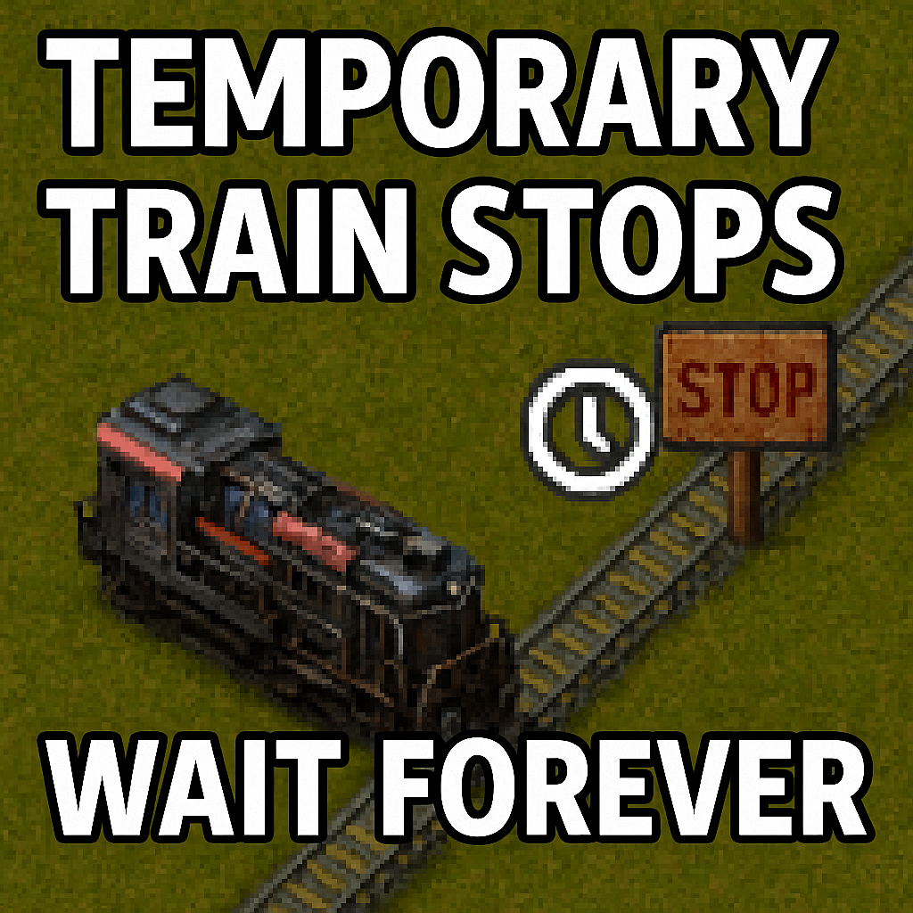

## Temporary Train Stops Wait Forever

By default, temporary train stops use a wait condition of "Time passed: 5 seconds".

If you think that's an unreasonable default, [you're not alone!](https://www.reddit.com/r/factorio/comments/19dxmx5/whats_the_reasoning_behind_the_default_temporary/)

This mod changes that to "Fluid: □ < 0", which effectively just waits forever.

You heard that right.  You just CTRL-click where you want the train to go, and it will wait there.
No settings, no fuss.

